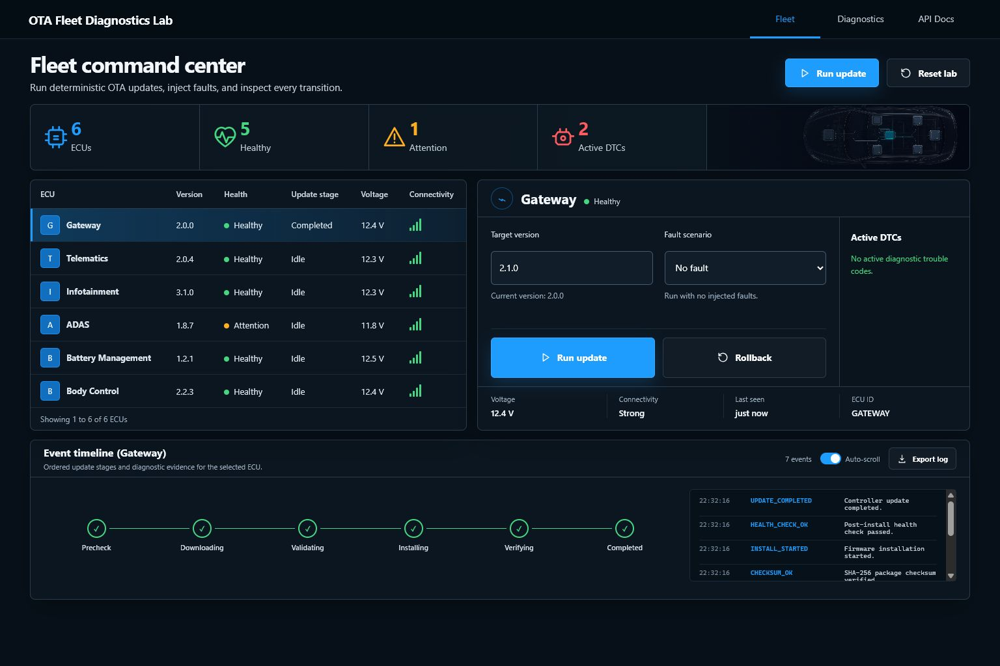
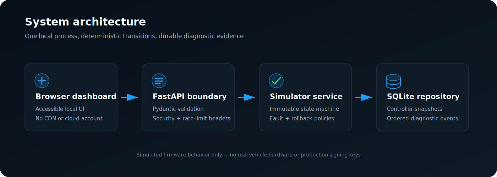

# OTA Fleet Diagnostics Lab

A virtual OTA fleet-update and diagnostics simulator for software-in-the-loop and test-infrastructure workflows.

> Built a virtual OTA fleet diagnostics simulator that validates update packages, version checks, installation failures, rollback behavior, and diagnostic trouble codes across simulated controllers.

This portfolio project is aimed at automotive charging, embedded test, and reliability engineering work—especially Supercharger SiL/test-infrastructure roles. It demonstrates update validation, deterministic fault injection, diagnostics, recovery, Python backend development, browser testing, and deployment-style reliability without claiming to flash real vehicle hardware.



## What it demonstrates

- Six persistent virtual ECUs: Gateway, Telematics, Infotainment, ADAS, Battery Management, and Body Control
- Strict `major.minor.patch` version policy and downgrade prevention
- Real SHA-256 validation against generated demo firmware bytes
- Ordered precheck, download, validation, installation, verification, completion, failure, and rollback events
- Deterministic low-voltage, connectivity-loss, checksum-mismatch, and installation-failure scenarios
- Automatic rollback for installation failure and one-shot manual rollback after a successful update
- Diagnostic trouble codes with human-readable root-cause evidence
- SQLite persistence, atomic update/event writes, and a resettable baseline fleet
- FastAPI REST endpoints with Pydantic input validation and a typed OpenAPI schema
- Request rate limiting, restrictive CSP/security headers, parameterized SQL, and safe error envelopes
- Responsive, accessible dashboard with event export and no CDN/runtime cloud dependency
- Non-root Docker image, container health check, Dependabot, and CI quality gates

## Architecture



The app is a small modular monolith:

1. The browser dashboard calls the versioned FastAPI boundary.
2. The application service invokes pure update/rollback transitions through the repository boundary.
3. Frozen domain models produce new controller snapshots rather than mutating shared state.
4. SQLite serializes each read/transition/write and commits the controller snapshot plus events atomically.

That design keeps the demo easy to run while preserving seams that could later support real package sources, hardware adapters, or a larger database.

## Quick start

Requires Python 3.13 or newer.

```bash
python -m venv .venv

# Windows PowerShell
.venv\Scripts\Activate.ps1

# macOS/Linux
source .venv/bin/activate

python -m pip install -e ".[dev]"
python main.py
```

Open [http://127.0.0.1:8000](http://127.0.0.1:8000). The machine-readable API schema is available at [http://127.0.0.1:8000/openapi.json](http://127.0.0.1:8000/openapi.json).

State is stored in `data/ota-lab.db`. Use `--database`, `--host`, and `--port` to override runtime defaults:

```bash
python main.py --database data/demo.db --host 127.0.0.1 --port 9000
```

## Docker

```bash
docker build -t ota-diagnostics-simulator .
docker run --rm -p 127.0.0.1:8000:8000 -v ota-data:/data ota-diagnostics-simulator
```

The simulator is intentionally a local lab, not a production vehicle-control service. The
localhost-only port binding prevents other machines from reaching state-changing demo endpoints.

The image runs as a non-root user and exposes `/health` for container health checks.

## Demo scenarios

Select an ECU, enter a newer target version, choose a fault, and run the update.

| Scenario | Failing stage | Result | Diagnostic |
|---|---|---|---|
| No fault | — | Target version installed and retained | Ordered success events |
| Low voltage | Precheck | Update blocked before download | `B1101` |
| Connectivity loss | Download | Payload transfer fails | `U0100` |
| Checksum mismatch | Validation | Tampered bytes fail SHA-256 comparison | `P0606` |
| Installation failure | Installation | Original version retained through automatic rollback | `U3000` |

A successful update records the prior version and enables manual rollback. Manual rollback is deliberately one-shot so repeated requests cannot oscillate between images.

## API

All API responses use a stable envelope:

```json
{
  "success": true,
  "data": {}
}
```

Core endpoints:

```text
GET  /health
GET  /api/v1/summary
GET  /api/v1/controllers
GET  /api/v1/controllers/{controller_id}
GET  /api/v1/events?controller_id=telematics&limit=100
POST /api/v1/controllers/{controller_id}/updates
POST /api/v1/controllers/{controller_id}/rollback
POST /api/v1/reset
```

Run an update:

```bash
curl -X POST http://127.0.0.1:8000/api/v1/controllers/telematics/updates \
  -H "Content-Type: application/json" \
  -d '{"target_version":"2.1.0","fault":"checksum_mismatch"}'
```

Invalid versions, controller IDs, fault names, extra JSON fields, and invalid state transitions are rejected before they can partially change fleet state.

## Tests and quality gates

The suite covers domain rules, immutable transitions, every fault path, SQLite persistence, reset behavior, API contracts, security headers, and a real Chromium user flow.

```bash
# Unit + integration + browser E2E with branch coverage
python -m playwright install chromium
python -m pytest --browser chromium \
  --cov=ota_simulator --cov-branch \
  --cov-report=term-missing

# Static checks
ruff format --check .
ruff check .
mypy ota_simulator
pip-audit
```

The current suite has **55 passing tests** with **92.27% branch coverage**, above the enforced 80%
gate. CI repeats every check and builds the Docker image.

## Project structure

```text
ota_simulator/
├── api.py             # Validation, response envelopes, security middleware
├── domain.py          # Frozen models, enums, semantic versions, packages
├── repository.py      # Parameterized SQLite persistence
├── scenarios.py       # Deterministic six-controller seed fleet
├── service.py         # Command boundary and atomic coordination
├── updater.py         # Pure update and rollback transitions
└── static/            # Responsive dashboard and generated visual asset

tests/
├── unit/              # Version, checksum, state-machine, immutability tests
├── integration/       # Persistence, service, and API contract tests
└── e2e/               # Live-server Chromium workflow
```

## Scope and safety

This is a software simulator, not production OTA infrastructure. It does not communicate with a CAN bus, Supercharger, vehicle, or remote firmware service. SHA-256 integrity checking is real, while package provenance, signing keys, secure boot, hardware compatibility, transport security, and regulatory/compliance controls are intentionally out of scope. Do not use it to claim production vehicle-flashing or automotive cybersecurity compliance.

## License

[MIT](LICENSE)
